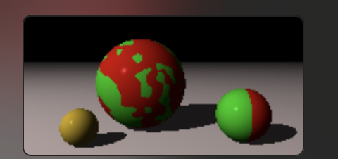
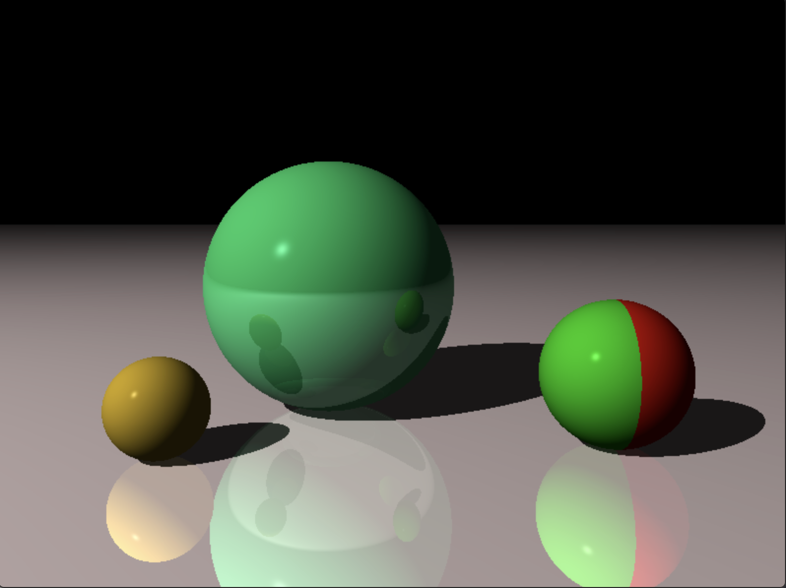
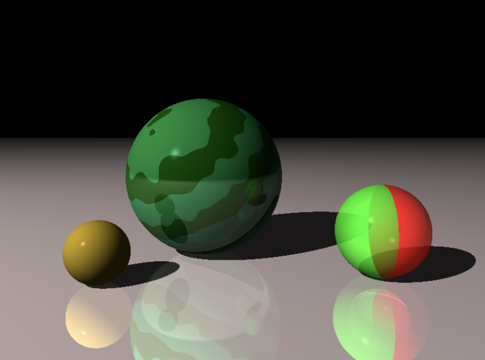
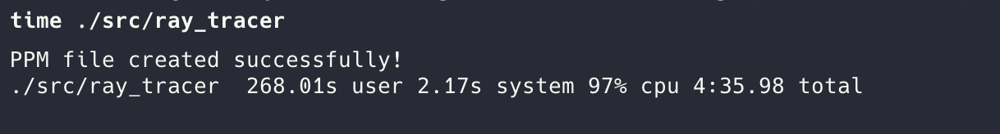
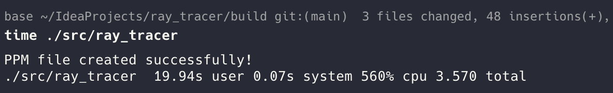
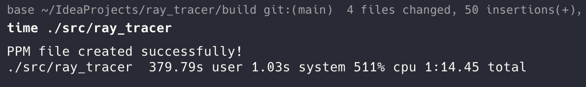

# Ray Tracer

A high-performance C++ ray tracer implementation featuring advanced rendering capabilities including materials, reflections, transparency, and multithreaded rendering for dramatic performance improvements.

## Renderer Showcase

### Material Rendering


*Demonstrating various material properties and textures*

### Reflections

*Realistic reflections with proper light interaction and surface properties*

### Transparency

*Transparent objects with proper refraction and light transmission*

## Performance Optimization

### Multithreading Performance Comparison

The renderer features significant performance improvements through multithreaded rendering:

#### 200x300 Resolution
| Before Multithreading | After Multithreading |
|----------------------|---------------------|
|  |  |

#### 800x600 Resolution  
| After Multithreading |
|---------------------|
|  |

**Performance gains achieved through:**
- Parallel pixel processing across multiple CPU cores
- Optimized ray-object intersection algorithms
- Efficient memory management for concurrent operations
- Dramatic reduction in rendering time for high-resolution images. **Notice**: the 800x600 runtime after multithreading is faster than the 200x300 before the optimization!

##  Features

- **Advanced Materials**: Support for diffuse, specular, and ambient lighting
- **Reflections**: Realistic surface reflections with proper light interaction
- **Transparency**: Transparent objects with refraction effects
- **Geometric Primitives**: Spheres and planes with transformation support
- **Camera System**: Configurable field of view and resolution
- **Multithreaded Rendering**: Significant performance improvements through parallel processing
- **PPM Output**: Standard image format for easy viewing and conversion
- **Comprehensive Testing**: Full test suite covering all rendering components

## Building the Project

### Prerequisites
- CMake 3.10 or higher
- C++17 compatible compiler
- Make

### Build Instructions

1. **Create and navigate to build directory:**
   ```bash
   mkdir build
   cd build
   ```

2. **Configure with CMake:**
   ```bash
   cmake ..
   ```

3. **Build everything:**
   ```bash
   make
   ```

## Running Tests

### Run All Tests
```bash
cd build
ctest
```

### Run Tests with Verbose Output
```bash
cd build
ctest --verbose
```

### Run Specific Test
```bash
cd build
ctest -R TupleTests
ctest -R CanvasTests
ctest -R CameraTests
# ... or any other test name
```

### Run Test Executable Directly
```bash
cd build
./tests/TupleTests
./tests/CanvasTests
./tests/CameraTests
# ... or any other test executable
```

### Build Only Tests
```bash
cd build
make tests
```

## Running the Main Program

### Build the Ray Tracer
```bash
cd build
make ray_tracer
```

### Run the Ray Tracer
```bash
cd build
./src/ray_tracer
```

## Available Test Suites

- `TupleTests` - Tuple operations and transformations
- `CanvasTests` - Canvas rendering and PPM output
- `CameraTests` - Camera functionality and ray generation
- `ColorTests` - Color operations and blending
- `IntersectionTests` - Ray-object intersection calculations
- `MatrixTests` - Matrix operations and transformations
- `PatternTests` - Material patterns and textures
- `PlaneTests` - Plane geometry and intersections
- `RayTests` - Ray operations and transformations
- `SphereTests` - Sphere geometry and intersections
- `TransformationTests` - Object transformations
- `LightTests` - Lighting calculations and shading
- `WorldTests` - Scene composition and rendering

## Quick Commands

```bash
# Build everything
make

# Run all tests
ctest

# Build and run ray tracer
make ray_tracer && ./src/ray_tracer

# Build specific test
make TupleTests

# Run specific test
./tests/TupleTests
```